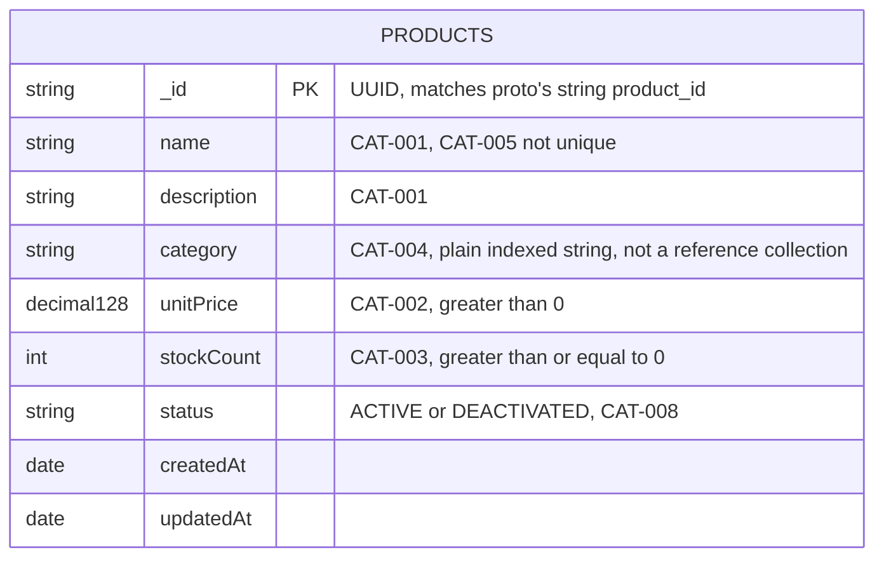

# catalog-service — ER Diagram

Source: `Archive/Development/Database` §2.1, verbatim schema at `Archive/Development/Database-Dev/mongo/00_catalog_schema.js`. MongoDB, database `catalog`. Single collection — no relationships to draw within this service; see `combined.md` for its cross-service references.

