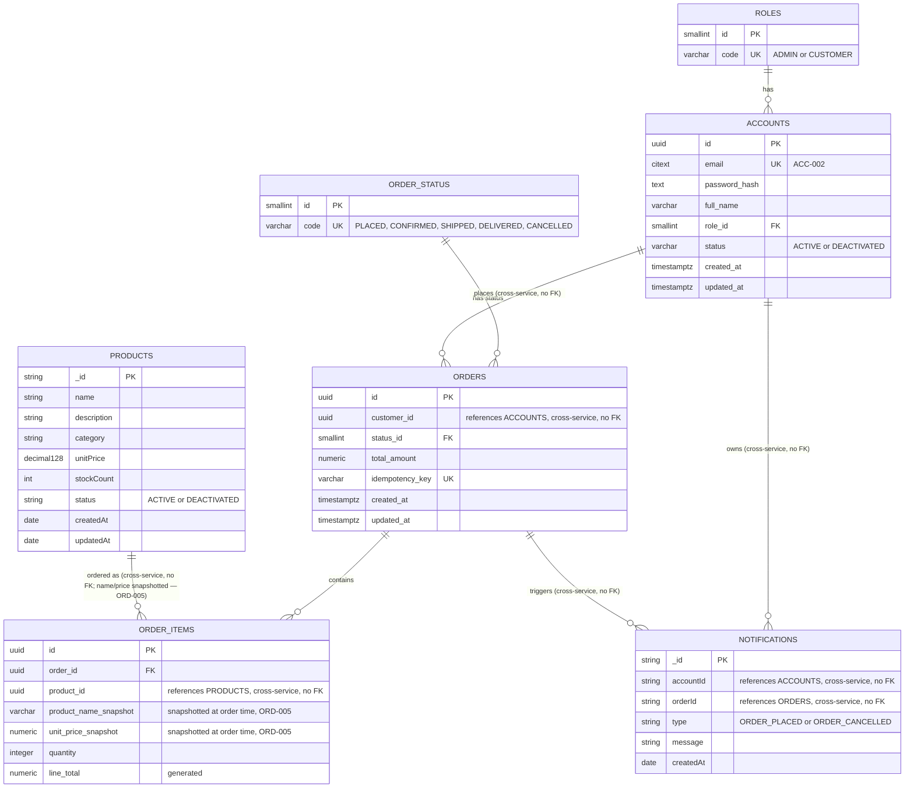

# MiniMart — Combined ER Diagram (all four services)

Source: `Archive/Development/Database` (all sections) and its §5 "Cross-service data duplication register". Each service still owns its own physical database — **no relationship below crossing a service boundary is a real foreign key**; every one is a plain ID column enforced at the application layer (via gRPC), per the database-per-service principle in `Archive/Development/Database` §0. That distinction is called out in each cross-service relationship label below, and is why this combined view is a companion to, not a replacement for, the four per-service diagrams in this directory.

Per `Archive/Development/Database` §5: no account email/name, no product category/description, and no order total are ever copied across a service boundary — the only fields duplicated anywhere are `product_name_snapshot`/`unit_price_snapshot` on `order_items` (required verbatim by ORD-005) and the plain ID references drawn above.
