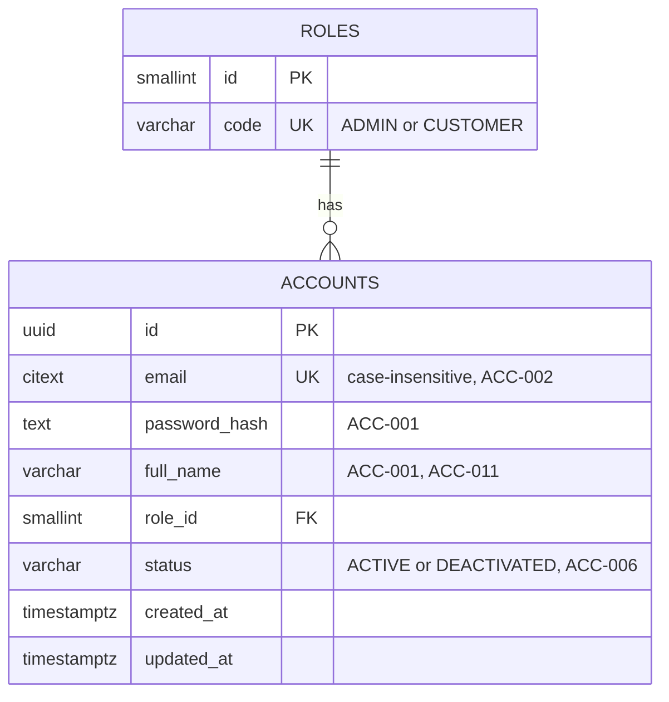

# identity-service — ER Diagram

Source: `Archive/Development/Database` §1.1, verbatim schema at `Archive/Development/Database-Dev/postgres/00_identity_schema.sql`. PostgreSQL, database `identity`.

