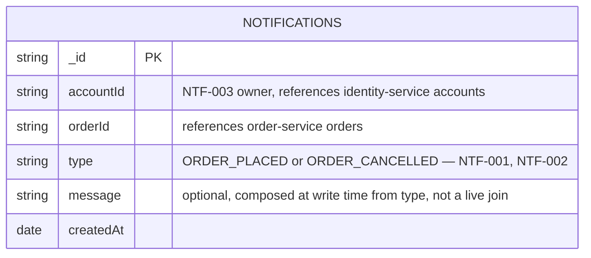

# notification-service — ER Diagram

Source: `Archive/Development/Database` §4.1, verbatim schema at `Archive/Development/Database-Dev/mongo/00_notifications_schema.js`. MongoDB, database `notifications`. Single collection, append-only — no relationships within this service; see `combined.md` for its cross-service references.

