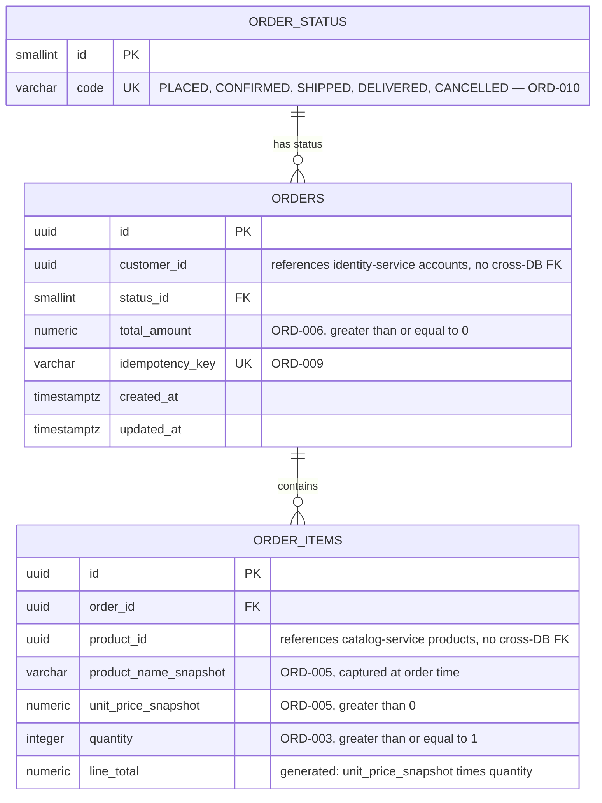

# order-service — ER Diagram

Source: `Archive/Development/Database` §3.1, verbatim schema at `Archive/Development/Database-Dev/postgres/00_orders_schema.sql`. PostgreSQL, database `orders`.

`order_id, product_id` is also a unique constraint (`uq_order_product`, ORD-004) — one line item per product per order, not representable as a Mermaid relationship, noted here instead.
